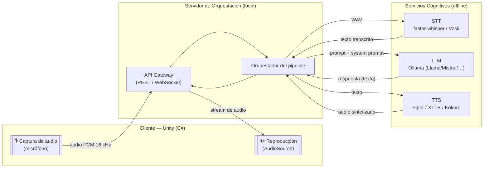
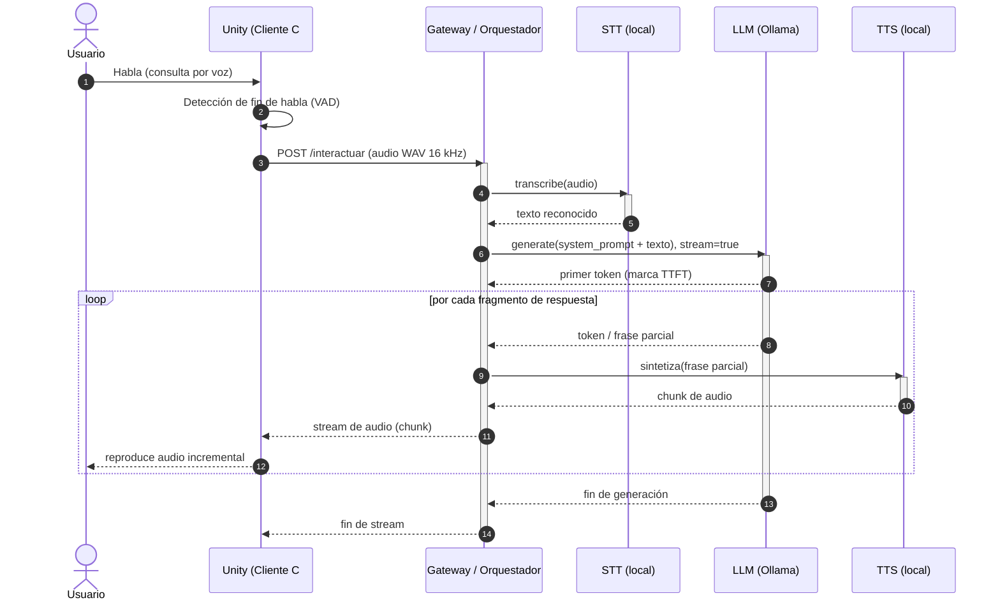

# Arquitectura y Pipeline de Comunicación del Agente Virtual

Este documento contiene los diagramas (en sintaxis **Mermaid**) que ilustran
cómo fluye la información de forma integrada entre el cliente de Unity y los
servicios cognitivos locales. Se renderizan automáticamente en GitHub; para el
PDF pueden exportarse a PNG con `mmdc` (mermaid-cli).

---

## 1. Diagrama de flujo de datos (alto nivel)

---

## 2. Diagrama de secuencia UML (detalle temporal)

Refleja el orden temporal y dónde se acumula la **latencia de extremo a
extremo** percibida por el usuario. El diseño busca minimizarla mediante
*streaming* token a token del LLM hacia el TTS.

---

## 3. Descripción conceptual del flujo

1. **Captura (Unity / C#).** El micrófono graba la consulta; un detector de
   actividad de voz (VAD) determina el fin del habla y empaqueta el audio en
   PCM de 16 kHz mono, el formato esperado por los motores STT.

2. **Transporte cliente→servidor.** El cliente envía el audio al orquestador.
   Para baja latencia se recomienda **WebSocket** (full-dúplex) sobre REST,
   permitiendo transmitir audio y recibir la respuesta en el mismo canal.

3. **Transcripción (STT).** El orquestador invoca el motor STT local
   (faster-whisper para mayor precisión, Vosk para mínima latencia). Produce el
   texto que alimentará al modelo de lenguaje.

4. **Razonamiento (LLM).** El texto se combina con el **System Prompt** que
   define la persona del agente ("Aurora") y se envía a Ollama en modo
   *streaming*. El primer token marca el **TTFT**, métrica crítica de la
   experiencia conversacional.

5. **Síntesis incremental (TTS).** En lugar de esperar la respuesta completa,
   el orquestador envía frases parciales al TTS conforme el LLM las genera,
   solapando generación y síntesis para reducir la latencia percibida.

6. **Propagación al cliente.** Los fragmentos de audio se transmiten de regreso
   a Unity, que los reproduce de forma incremental, dando la sensación de una
   respuesta fluida y natural.

> El benchmarking de este repositorio mide de forma aislada las etapas 3, 4 y 5
> (STT, LLM, TTS) para fundamentar, con datos empíricos, qué combinación de
> servicios optimiza la latencia total de este pipeline según el escenario.
