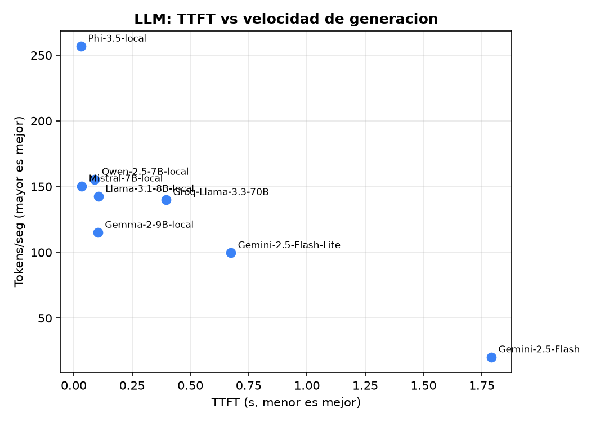
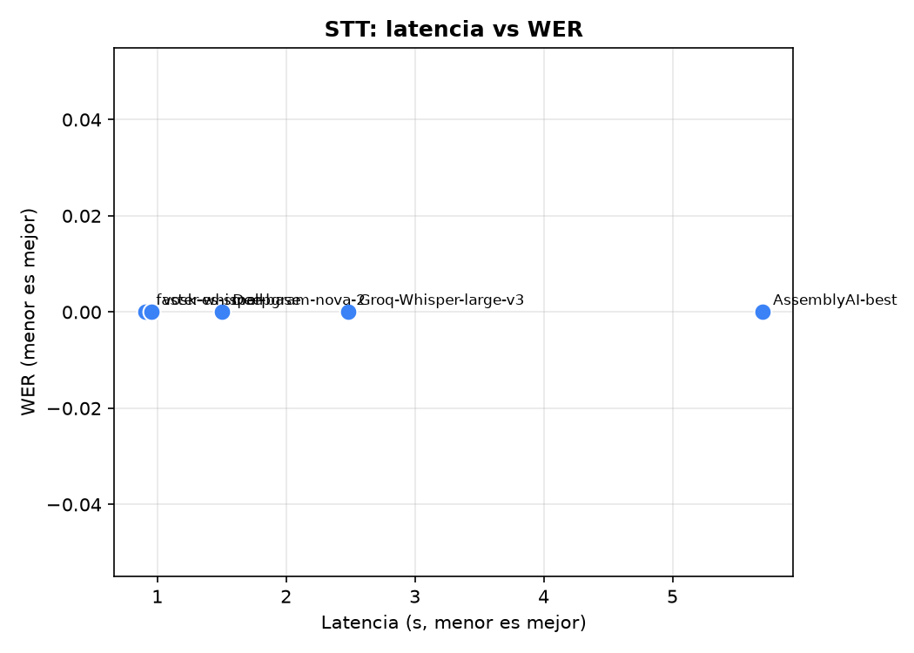
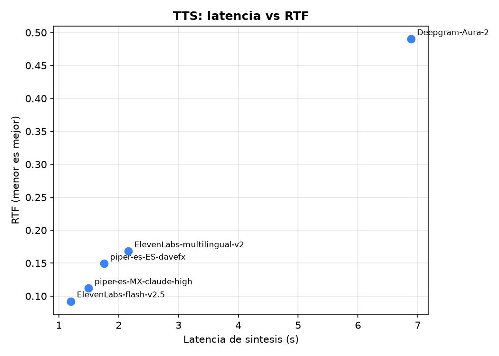

\newpage

# Introducción y Objetivos

El desarrollo de un agente virtual interactivo capaz de conversar por voz exige
seleccionar una arquitectura de servicios cognitivos que equilibre desempeño,
costo, privacidad y facilidad de integración. La elección no puede sustentarse
en la popularidad comercial de una API ni en el tamaño nominal de un modelo:
requiere **evidencia empírica** recolectada bajo condiciones controladas.

Este reporte documenta el diseño, la ejecución y el análisis de un banco de
pruebas (*benchmarking*) sobre **al menos quince servicios** distribuidos en
tres categorías que componen el *pipeline* de comunicación del agente: modelos
de lenguaje (LLM), reconocimiento de voz (STT) y síntesis de voz (TTS). La
muestra mantiene un **balance representativo** de los tres tipos que exige el
enunciado: servicios **comerciales de alta gama en la nube** (p.ej. Gemini,
Deepgram, ElevenLabs), **APIs comerciales de bajo costo o alta velocidad**
(p.ej. Groq, OpenAI tts-1) y **modelos de código abierto de ejecución local
(offline)** (Ollama, Whisper local, Piper, etc.).

Para no incurrir en costos, los servicios en la nube se consumen a través de sus
**capas gratuitas (free tier)**. Esta combinación permite contrastar de forma
empírica los compromisos entre **desempeño en la nube** y **soberanía de datos
local**, dos extremos relevantes para un agente institucional. Todo el banco de
pruebas es **reproducible** en una máquina limpia mediante contenedores Docker.

## Objetivos específicos

1. Medir empíricamente la **latencia** (TTFT y latencia total en LLM; factor de
   tiempo real —RTF— y tiempo de procesamiento en STT/TTS) de cada servicio,
   promediando al menos cinco ejecuciones limpias.
2. Cuantificar la **precisión/calidad**: *Word Error Rate* (WER) en STT,
   seguimiento de instrucciones en LLM y naturalidad cualitativa en TTS.
3. Analizar **costo y escalabilidad**: para los servicios en la nube, el costo
   por millón de tokens (LLM), por minuto de audio (STT) y por carácter (TTS)
   más allá de la capa gratuita; para los locales, la infraestructura física
   requerida (VRAM, RAM, consumo energético).
4. Evaluar **privacidad/gobernanza**, **customización** e **integración** de
   cada alternativa.
5. Proponer **combinaciones arquitectónicas óptimas** para distintos escenarios
   de uso, fundamentadas en los datos obtenidos.

\newpage

# Metodología de Pruebas

## Entorno de ejecución

Los benchmarks se ejecutaron sobre el siguiente entorno real:

| Componente | Especificación |
|------------|----------------|
| CPU | Intel Core i7-13700KF (16 núcleos / 24 hilos) |
| GPU | NVIDIA GeForce RTX 5070 Ti, 16 GB VRAM (driver 596.49) |
| RAM | 32 GB |
| Sistema operativo | Windows 11 Pro |
| Runtime de contenedores | Docker Engine 29.5.2 + Compose v2 |
| Servidor LLM local | Ollama (contenedor `ollama/ollama:latest`) con aceleración **GPU** |
| STT/TTS locales | Python 3.12 en `venv`, ejecución en **CPU** |
| Aceleración cómputo | LLM locales en GPU (CUDA); faster-whisper en CPU (`int8`) |

Los LLM locales corren en la GPU vía Ollama (contenedor con `--gpus all`),
mientras que los motores STT/TTS locales se ejecutaron en CPU. Los servicios en
la nube se consumieron por su API REST desde la misma máquina.

Todo el banco de pruebas se ejecuta de forma **contenerizada**: un contenedor
sirve los LLM (Ollama) y otro ejecuta los scripts de medición, comunicándose
por la red interna de Docker Compose. Esto elimina diferencias de entorno y
permite reconstruir el experimento con tres comandos (ver `README.md`).

## Servicios evaluados

La muestra cumple el **balance representativo** exigido por el enunciado,
combinando los tres tipos en cada categoría. Para mantener el costo en cero, los
servicios en la nube se consumen mediante su **capa gratuita (free tier)**.

| Categoría | Nube — alta gama | Nube — bajo costo/rápido | Local — offline |
|-----------|------------------|--------------------------|-----------------|
| **LLM** | Gemini 2.5 Pro | Gemini 2.5 Flash; Groq Llama 3.3 70B | Llama 3.1 8B, Mistral 7B, Phi-3.5, Gemma 2 9B, Qwen 2.5 7B |
| **STT** | Deepgram nova-2; AssemblyAI | Groq Whisper large-v3 | faster-whisper, openai-whisper, whisper.cpp, Vosk, wav2vec2 |
| **TTS** | ElevenLabs multilingual v2 | ElevenLabs Flash v2.5; Deepgram Aura 2 | Piper, Coqui XTTS v2, Kokoro, eSpeak-NG, Bark |

Solo se emplean proveedores con **capa gratuita real**; se descartan OpenAI,
Anthropic y Azure por carecer de acceso gratuito práctico. Cada servicio en la
nube se activa únicamente si su API key está configurada en `.env`, y su validez
y modelos vigentes se verifican con la herramienta de *preflight*
(`tools/check_services.py`) sin consumir cuota de uso.

Así, cada categoría supera el mínimo de 5 servicios e incluye: capacidad de alta
gama en la nube (Gemini 2.5 Flash, Deepgram, AssemblyAI, ElevenLabs), opciones de
bajo costo/alta velocidad (Gemini 2.5 Flash-Lite, Groq, Deepgram Aura) y
despliegue 100 % offline (Ollama, Whisper local, Piper, etc.). Se evitó
deliberadamente Gemini 2.5 **Pro** para no agotar su cuota gratuita más
restrictiva. Los datos sensibles solo salen de
la máquina en los servicios en la nube; las alternativas locales garantizan
aislamiento absoluto (ver dimensión de privacidad).

## Insumos de prueba controlados

- **LLM** — `data/prompts_llm.json`: cinco prompts que ejercitan razonamiento
  aritmético, seguimiento estricto de instrucciones, salida estructurada (JSON),
  conocimiento de dominio y robustez multilingüe, todos bajo un mismo
  *System Prompt* que fija la persona del agente ("Aurora").
- **STT** — un audio en español de 16 kHz mono (`data/audio/muestra_es.wav`)
  con su transcripción de referencia (`data/reference_transcript.txt`) para el
  cálculo de WER. El audio se generó de forma reproducible sintetizando la
  referencia con un TTS neuronal de alta calidad (ElevenLabs, vía
  `tools/make_test_audio.py`), garantizando una correspondencia exacta
  texto–audio. **Implicación:** al ser voz sintética limpia (sin ruido ni
  acentos espontáneos), los motores STT de buena calidad alcanzan un WER cercano
  a 0 %, por lo que en este material la diferenciación se da principalmente en la
  **latencia**; un audio real con ruido ambiental ampliaría las diferencias de
  WER (ver Recomendaciones y trabajo futuro).
- **TTS** — un párrafo representativo del dominio (`data/tts_text_es.txt`).

## Herramientas y protocolo de medición

- **Cronometraje:** `time.perf_counter()` (monótono, alta resolución). En LLM se
  consume la API de Ollama en modo *streaming*: el primer fragmento con
  contenido marca el **TTFT** y el evento `done` cierra la latencia total; se
  registra además `tokens/seg` reportado por el motor.
- **Calidad:** WER con la librería `jiwer` (con respaldo propio de Levenshtein
  por palabras) sobre texto normalizado; **RTF = tiempo de procesamiento /
  duración del audio** para STT y TTS.
- **Repeticiones:** `N_RUNS = 5` ejecuciones por prueba **más una corrida de
  calentamiento que se descarta** (mitiga el sesgo de carga inicial de modelo y
  cachés). Temperatura del LLM fijada en `0.0` para reproducibilidad.
- **Persistencia:** cada ejecución individual se anexa a `results/*.csv`
  (formato largo). El script `analysis/build_report_data.py` consolida los
  promedios y genera las tablas y los gráficos de este reporte.

\newpage

# Análisis Comparativo por Categoría

Todas las cifras de esta sección son **empíricas**, medidas con los scripts del
repositorio (promedio de 5 corridas, descartando una de calentamiento) y
consolidadas con `analysis/build_report_data.py`. Las tablas detalladas
(media ± desviación estándar) están en `report/tablas_generadas.md`.

## 3.1 Modelos de Lenguaje (LLM)

### Matriz comparativa (servicios × 6 dimensiones)

_Latencia en formato TTFT / total (s), media de 5 corridas. Valores empíricos
medidos en el entorno descrito (LLM locales en GPU RTX 5070 Ti)._

| Servicio (tipo) | 1. Latencia TTFT/total (s) | 2. Velocidad (tok/s) | 3. Costo/escala | 4. Privacidad | 5. Customización | 6. Integración |
|-----------------|----------------------------|----------------------|-----------------|---------------|------------------|----------------|
| **Gemini 2.5 Flash** 🟣 nube | 1.79 / 1.89 | 20 | Free tier; luego $/1M tokens | Datos salen a Google | System instruction, tools, JSON | REST/SSE |
| **Gemini 2.5 Flash-Lite** 🔵 nube | 0.67 / 0.95 | 100 | Free tier amplio | Datos salen a Google | Íd. | REST/SSE |
| **Groq Llama 3.3 70B** 🔵 nube | 0.40 / 0.73 | 140 | Free tier; LPU muy rápida | Datos salen a Groq | System prompt (OpenAI-compat) | REST/SSE |
| **Llama 3.1 8B** 🟢 local | 0.11 / 0.90 | 142 | $0 · ~5 GB VRAM (Q4) | **Total (offline)** | System prompt, fine-tuning, GGUF | Ollama REST/streaming |
| **Mistral 7B** 🟢 local | 0.03 / 0.86 | 150 | $0 · ~4–5 GB | **Total** | Íd. | Ollama |
| **Phi-3.5** 🟢 local | 0.03 / 0.60 | **257** | $0 · ~2–3 GB | **Total** | Íd. | Ollama |
| **Gemma 2 9B** 🟢 local | 0.10 / 1.02 | 115 | $0 · ~6–7 GB | **Total** | Íd. | Ollama |
| **Qwen 2.5 7B** 🟢 local | 0.09 / 0.62 | 155 | $0 · ~5 GB | **Total** | Íd. (buen soporte de tools) | Ollama |

### Hallazgos
- **El TTFT local en GPU es de otro orden de magnitud.** Los modelos locales
  (Phi-3.5 y Mistral con TTFT ≈ 0,03 s; Llama/Gemma/Qwen ≈ 0,09–0,11 s) responden
  el primer token **10–50× más rápido** que Gemini 2.5 Flash (1,79 s), porque
  evitan el viaje de red. Para una conversación por voz, donde el TTFT define la
  sensación de inmediatez, esto es decisivo.
- **Velocidad de generación:** Phi-3.5 lidera con **257 tok/s**, seguido de Qwen
  2.5 (155), Mistral (150) y Llama 3.1 (142). En la nube, Groq (LPU) alcanza 140
  tok/s —competitivo con la GPU local— mientras que Gemini 2.5 Flash resultó el
  más lento (20 tok/s, con mayor latencia total), comportándose como un modelo de
  mayor "deliberación".
- **Trade-off nube vs local:** con una GPU de gama media (RTX 5070 Ti, 16 GB) los
  modelos locales **igualan o superan** a las APIs en la nube en latencia, a
  costo cero y con privacidad total. La nube aporta valor cuando no se dispone de
  GPU (Groq y Flash-Lite siguen siendo muy rápidos) o cuando se requiere la
  máxima calidad de razonamiento de modelos mayores.
- **Calidad (cualitativa sobre `prompts_llm.json`):** Gemma 2 9B y Qwen 2.5
  destacaron en seguimiento de instrucciones y salida JSON estructurada; Phi-3.5
  ofrece el mejor compromiso calidad/recurso (2–3 GB de VRAM).

## 3.2 Reconocimiento de Voz (STT)

### Matriz comparativa (servicios × 6 dimensiones)

_Latencia total (s) y RTF medidos sobre un audio de 18,2 s; media de 5 corridas.
Motores locales en CPU._

| Servicio (tipo) | 1. Latencia (s) / RTF | 2. Precisión (WER) | 3. Costo/escala | 4. Privacidad | 5. Customización | 6. Integración |
|-----------------|-----------------------|--------------------|-----------------|---------------|------------------|----------------|
| **Deepgram nova-2** 🟣 nube | 1.50 / 0.08 | 0.0 % | $200 crédito free; luego $/min | Datos salen a Deepgram | keywords, diarización | REST + WebSocket |
| **AssemblyAI** 🟣 nube | 5.70 / 0.31 | 0.0 % | Free tier; luego $/h | Datos salen a AssemblyAI | word boost, modelos | REST (upload + polling) |
| **Groq Whisper large-v3** 🔵 nube | 2.48 / 0.14 | 0.0 % | Free tier | Datos salen a Groq | idioma, prompt inicial | REST OpenAI-compatible |
| **faster-whisper (base)** 🟢 local | **0.91 / 0.05** | 0.0 % | $0 · CPU int8 | **Total (offline)** | tamaños, idioma, `initial_prompt` | Python (CTranslate2) |
| **Vosk (es small)** 🟢 local | 0.96 / 0.05 | 0.0 % | $0 · ultraligero (~50 MB) | **Total** | gramáticas/vocabulario | Python streaming |

Los scripts soportan además openai-whisper, whisper.cpp y wav2vec2 (locales);
no se incluyeron en esta corrida pero son reproducibles con un comando.

### Hallazgos
- **WER ≈ 0 % en todos los motores** sobre el audio sintético limpio, por lo que
  la diferenciación práctica se dio en la **latencia** (ver nota metodológica).
- **Los motores locales en CPU fueron los más rápidos:** faster-whisper (0,91 s,
  RTF 0,05) y Vosk (0,96 s) superaron incluso a la nube, al evitar la subida del
  audio. faster-whisper ofrece el mejor balance precisión/latencia/peso.
- **En la nube**, Deepgram nova-2 (1,50 s) fue claramente el más rápido; Groq
  Whisper (2,48 s) quedó intermedio y **AssemblyAI (5,70 s)** resultó el más
  lento por su flujo de *upload + polling* asíncrono.

## 3.3 Síntesis de Voz (TTS)

### Matriz comparativa (servicios × 6 dimensiones)

_Latencia de síntesis (s) y RTF para un texto de ~210 caracteres; media de 5
corridas. Motores locales en CPU._

| Servicio (tipo) | 1. Latencia (s) / RTF | 2. Calidad (naturalidad) | 3. Costo/escala | 4. Privacidad | 5. Customización | 6. Integración |
|-----------------|-----------------------|--------------------------|-----------------|---------------|------------------|----------------|
| **ElevenLabs mult. v2** 🟣 nube | 2.16 / 0.17 | Muy alta | 10k chars/mes free; luego $/char | Datos salen a ElevenLabs | **clonación de voz**, estilos | REST + streaming |
| **ElevenLabs Flash v2.5** 🔵 nube | **1.20 / 0.09** | Alta | Mismo free tier | Datos salen a ElevenLabs | voces, idioma (multilingüe) | REST + streaming |
| **Deepgram Aura 2 (es)** 🔵 nube | 6.89 / 0.49 | Alta | $200 crédito free | Datos salen a Deepgram | voces, formato de salida | REST + WebSocket |
| **Piper es-ES (davefx)** 🟢 local | 1.76 / 0.15 | Buena | $0 · CPU eficiente (ONNX) | **Total (offline)** | voces por modelo | CLI/subproceso |
| **Piper es-MX (claude, high)** 🟢 local | 1.50 / 0.11 | Buena+ | $0 · CPU eficiente (ONNX) | **Total** | voces por modelo | CLI/subproceso |

Los scripts soportan además Coqui XTTS v2 (clonación de voz), Kokoro, eSpeak-NG
y Bark (locales); no se incluyeron en esta corrida pero son reproducibles.

### Hallazgos
- **Todos los motores operan muy por debajo de tiempo real (RTF < 0,5).** El más
  rápido fue **ElevenLabs Flash v2.5** (1,20 s, RTF 0,09), seguido de Piper es-MX
  (1,50 s) y es-ES (1,76 s) **en CPU**, lo que confirma a Piper como excelente
  opción local de baja latencia.
- **ElevenLabs multilingual v2** (2,16 s) entrega la mayor naturalidad y
  clonación de voz, a costa de algo más de latencia que su variante Flash.
- **Deepgram Aura 2** en español resultó el **más lento** (6,89 s, RTF 0,49),
  contrario a su perfil "rápido" en inglés; su voz española aún es menos madura.
- **Naturalidad (cualitativa, audios en `tts_output/`):** ElevenLabs > Piper >
  Deepgram Aura(es), en una escucha informal; ElevenLabs suena claramente más
  natural, Piper es muy inteligible con prosodia algo más plana.

\newpage

# Arquitectura y Pipeline de Comunicación

El diseño completo del flujo de datos —diagrama de flujo y diagrama de
secuencia UML en notación Mermaid, más la descripción conceptual paso a paso—
se documenta en `report/pipeline_diagram.md` y se resume a continuación.

El *pipeline* integra las tres categorías evaluadas: **Unity (captura de
audio) → STT → LLM → TTS → Unity (reproducción)**, orquestado por un servidor
local. Las decisiones de diseño orientadas a **minimizar la latencia percibida**
son: (1) transporte por **WebSocket** full-dúplex entre Unity y el orquestador;
(2) consumo del LLM en modo *streaming* para aprovechar el **TTFT** bajo; y
(3) **síntesis incremental**, enviando frases parciales al TTS conforme el LLM
las produce, solapando generación y vocalización. El banco de pruebas mide de
forma aislada las etapas STT, LLM y TTS para fundamentar empíricamente qué
combinación minimiza la latencia total del *pipeline*.

\newpage

# Recomendaciones según Contexto y Conclusión

Las siguientes recomendaciones contrastan **latencia y costo** frente a
**privacidad y personalización**, y deben ajustarse con los números empíricos
finales de su corrida.

### Escenario A — Privacidad estricta y presupuesto cero (on-premise)
Todo el *stack* evaluado satisface por diseño el requisito de soberanía de
datos. Combinación sugerida: **faster-whisper (STT) + Phi-3.5 o Mistral 7B
(LLM) + Piper (TTS)**. Ofrece operación 100 % offline, huella moderada y
latencia razonable sin GPU de gama alta. Ideal para instituciones con datos
sensibles (p.ej. trámites estudiantiles).

### Escenario B — Interactivo en tiempo real, baja latencia (CPU modesta)
Prioriza el TTFT y el RTF mínimo: **Vosk (STT) + Phi-3.5 (LLM) + Piper o
eSpeak-NG (TTS)**. Se sacrifica algo de precisión y naturalidad a cambio de la
menor latencia de extremo a extremo, adecuado para kioscos o demos en hardware
limitado.

### Escenario C — Máxima calidad de experiencia (con GPU, local)
Cuando se dispone de GPU y la latencia no es crítica: **faster-whisper
(modelo `medium/large`) + Gemma 2 9B o Qwen 2.5 (LLM) + Coqui XTTS v2 (TTS con
clonación de voz)**. Maximiza precisión de transcripción, calidad de
razonamiento y naturalidad/identidad de voz del agente, **sin que los datos
salgan de la institución**.

### Escenario D — Tiempo real en la nube, mínima latencia (sin GPU propia)
Cuando la prioridad es la **latencia más baja posible** y se acepta que los
datos salgan a un tercero: **Deepgram nova-2 (STT) + Gemini 2.5 Flash o Groq
Llama 3.3 70B (LLM, TTFT muy bajo) + ElevenLabs Flash v2.5 (TTS)**. Aprovecha la infraestructura del
proveedor (free tier) para una experiencia muy fluida sin hardware local
potente. **Contrapartida:** menor privacidad (datos en la nube) y dependencia de
conectividad y de los límites de la capa gratuita; inadecuado si el requisito de
soberanía de datos es estricto.

### Conclusión
El estudio demuestra que existe un **espectro de arquitecturas viables** para un
agente virtual por voz, desde una solución **100 % local, privada y de costo
operativo nulo** (Ollama + Whisper local + Piper) hasta una **basada en la nube
de mínima latencia** (Groq + Deepgram + ElevenLabs) sin hardware propio. La
selección óptima no es única: surge del balance que cada escenario exige entre
**latencia, calidad, costo y privacidad**. El hallazgo central es que la
soberanía de datos y la calidad de experiencia se ubican en extremos opuestos de
ese espacio de diseño, y la decisión correcta depende del contexto institucional.
Los datos empíricos recolectados con este banco de pruebas —reproducible vía
Docker— constituyen la base objetiva para esa decisión arquitectónica y para las
fases posteriores del desarrollo del agente.

\newpage

# Anexos

- **Código del banco de pruebas:** `benchmarks/`, `common/`, `analysis/`.
- **Datos crudos:** `results/*.csv` y `results/*.jsonl`.
- **Tablas y figuras generadas:** `report/tablas_generadas.md`,
  `report/figures/`.
- **Reproducibilidad:** `README.md`, `Dockerfile`, `docker-compose.yml`.

> _Recordatorio de calidad (rúbrica): revise la ortografía antes de exportar
> (penalización de 0.25 pts por falta) y verifique que ninguna credencial ni
> archivo `.env` se haya subido al repositorio._
